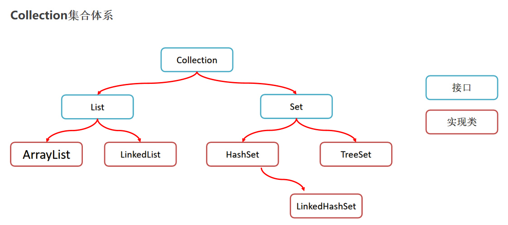

[TOC]

# 什么是API?

- API(Application Programming interface)  应用程序编程接口。
- 简单来说：就是Java帮我们已经写好的一些方法，我们直接拿过来用就可以了。

# Object类的常用方法

| 方法名                          |                             说明                             |
| ------------------------------- | :----------------------------------------------------------: |
| public String toString()        |  默认是返回当前对象在堆内存中的地址信息:类的全限名@内存地址  |
| public boolean equals(Object o) | 默认是比较当前对象与另一个对象的地址是否相同，相同返回true，不同返回false |

toString存在的意义：

- 父类toString()方法存在的意义就是为了被子类重写，以便返回对象的内容信息，而不是地址信息！！

直接比较两个对象的地址是否相同完全可以用“==”替代equals。
equals存在的意义:

- 父类equals方法存在的意义就是为了被子类重写，以便子类自己来定制比较规则。


# Objects的常见方法

Objects是一个工具类，提供了一些方法去完成一些功能。

使用Objects的equals方法在进行对象的比较会更安全

| 方法名                                           | 说明                                                         |
| ------------------------------------------------ | ------------------------------------------------------------ |
| public static boolean equals(Object a, Object b) | 比较两个对象的，底层会先进行非空判断，从而可以避免空指针异常。再进行equals比较 |
| public static boolean isNull(Object obj)         | 判断变量是否为null ,为null返回true ,反之                     |

源码：

```java
public static boolean equals(Object a, Object b) 
{    
	return (a == b) || (a != null && a.equals(b));
}

```


# StringBuilder概述

StringBuilder是一个可变的字符串类，我们可以把它看成是一个对象容器。

**作用：**提高字符串的操作效率，如拼接、修改等。

StringBuilder 构造器

| 名称                             | 说明                                           |
| -------------------------------- | ---------------------------------------------- |
| public StringBuilder()           | 创建一个空白的可变的字符串对象，不包含任何内容 |
| public StringBuilder(String str) | 创建一个指定字符串内容的可变字符串对象         |

StringBuilder常用方法

| 方法名称                              | 说明                                                |
| ------------------------------------- | --------------------------------------------------- |
| public StringBuilder append(任意类型) | 添加数据并返回StringBuilder对象本身                 |
| public StringBuilder reverse()        | 将对象的内容反转                                    |
| public int length()                   | 返回对象内容长度                                    |
| public String toString()              | 通过toString()就可以实现把StringBuilder转换为String |

# Math 类的常用方法

| 方法名                                      | 说明                                  |
| ------------------------------------------- | ------------------------------------- |
| public static int abs(int a)                | 获取参数绝对值                        |
| public static double ceil(double a)         | 向上取整                              |
| public static double floor(double a)        | 向下取整                              |
| public static int round(float a)            | 四舍五入                              |
| public static int max(int a,int b)          | 获取两个int值中的较大值               |
| public static double pow(double a,double b) | 返回a的b次幂的值                      |
| public static double random()               | 返回值为double的随机值，范围[0.0,1.0) |

# System 类概述

System也是一个工具类，代表了当前系统，提供了一些与系统相关的方法。

System 类的常用方法 

| 方法名                                                       | 说明                                         |
| ------------------------------------------------------------ | -------------------------------------------- |
| public static void exit(int status)                          | 终止当前运行的 Java 虚拟机，非零表示异常终止 |
| public static long currentTimeMillis()                       | 返回当前系统的时间毫秒值形式                 |
| public static void arraycopy(数据源数组, 起始索引, 目的地数组, 起始索引, 拷贝个数) | 数组拷贝                                     |

# BigDecimal作用

用于解决浮点型运算精度失真的问题

使用步骤
创建对象BigDecimal封装浮点型数据（最好的方式是调用方法）

```
public static BigDecimal valueOf(double val):   包装浮点数成为BigDecimal对象。
```


BigDecima常用API

| 方法名                                                       | 说明 |
| ------------------------------------------------------------ | ---- |
| public BigDecimal add(BigDecimal b)                          | 加法 |
| public BigDecimal subtract(BigDecimal b)                     | 减法 |
| public BigDecimal multiply(BigDecimal b)                     | 乘法 |
| public BigDecimal divide(BigDecimal b)                       | 除法 |
| public BigDecimal divide (另一个BigDecimal对象，精确几位，舍入模式) | 除法 |

BigDecimal 转化为Double 的方法：

double money = BigDecimal.valueOf( 0.1 ).doubelValue();

```
BigDecimal的作用是什么？
解决浮点型运算精度失真问题。

BigDecimal divide = bd1.divide(参与运算的对象, 小数点后精确到多少位, 舍入模式);
参数1 ，表示参与运算的BigDecimal 对象。
参数2 ，表示小数点后面精确到多少位
参数3 ，舍入模式
BigDecimal.ROUND_UP  进一法
BigDecimal.ROUND_FLOOR 去尾法
BigDecimal.ROUND_HALF_UP 四舍五入

BigDecimal的对象如何获取？
BigDecimal b1 = BigDecimal.valueOf(0.1);
```

# Date 类概述

Date类代表当前所在系统的日期时间信息。

Date的构造器

| 名称          | 说明                                             |
| ------------- | ------------------------------------------------ |
| public Date() | 创建一个Date对象，代表的是系统当前此刻日期时间。 |

Date的常用方法

| 名称                  | 说明                                             |
| --------------------- | ------------------------------------------------ |
| public long getTime() | 返回从1970年1月1日  00:00:00走到此刻的总的毫秒数 |

时间毫秒值 -> 日期对象

| 构造器                 | 说明                             |
| ---------------------- | -------------------------------- |
| public Date(long time) | 把时间毫秒值转换成Date日期对象。 |

| Date方法                       | 说明                                         |
| ------------------------------ | -------------------------------------------- |
| public void setTime(long time) | 设置日期对象的时间为当前时间毫秒值对应的时间 |

# SimpleDateFormat 类作用

可以去完成日期时间的格式化操作

构造器

| 构造器                                  | 说明                                     |
| --------------------------------------- | ---------------------------------------- |
| public SimpleDateFormat(String pattern) | 构造一个SimpleDateFormat，使用指定的格式 |

格式化方法

| 格式化方法                                  | 说明                              |
| ------------------------------------------- | --------------------------------- |
| public final String **format(Date date)**   | 将日期格式化成日期/时间字符串     |
| public final String **format(Object time)** | 将时间毫秒值式化成日期/时间字符串 |

格式化的时间形式的常用的模式对应关系如下：

  y	年
  M	月
  d	日
  H	时
  m	分
  s	秒

2020-11-11 13:27:06     yyyy-MM-dd HH:mm:ss  

SimpleDateFormat解析字符串时间成为日期对象

| 解析方法                             | 说明                                 |
| ------------------------------------ | ------------------------------------ |
| public Date **parse(String source)** | 从给定字符串的开始解析文本以生成日期 |

# Calendar概述

Calendar代表了系统此刻日期对应的日历对象。
Calendar是一个抽象类，不能直接创建对象。

Calendar日历类创建日历对象的方法：

| 方法名                               | 说明             |
| ------------------------------------ | ---------------- |
| public static Calendar getInstance() | 获取当前日历对象 |

Calendar常用方法

| 方法名                                | 说明                        |
| ------------------------------------- | --------------------------- |
| public int get(int field)             | 取日期中的某个字段信息。    |
| public void set(int field,int value)  | 修改日历的某个字段信息。    |
| public void add(int field,int amount) | 为某个字段增加/减少指定的值 |
| public final Date getTime()           | 拿到此刻日期对象。          |
| public long getTimeInMillis()         | 拿到此刻时间毫秒值          |

注意：calendar是可变日期对象，一旦修改后其对象本身表示的时间将产生变化。

# 从Java 8开始，java.time包

提供了新的日期和时间API，主要涉及的类型有：

- LocalDate：不包含具体时间的日期。
- LocalTime：不含日期的时间。
- LocalDateTime：包含了日期及时间。
- Instant：代表的是时间戳。
- DateTimeFormatter 用于做时间的格式化和解析的
- Duration:用于计算两个“时间”间隔 
- Period:用于计算两个“日期”间隔

新增的API严格区分了时刻、本地日期、本地时间，并且，对日期和时间进行运算更加方便。
其次，新API的类型几乎全部是不变类型（和String的使用类似），可以放心使用不必担心被修改。

### LocalDate、LocalTime、LocalDateTime

他们 分别表示日期，时间，日期时间对象，他们的类的实例是不可变的对象。
他们三者构建对象和API都是通用的

构建对象的方式如下：

| 方法名                    | 说明                            |                                                              |
| ------------------------- | ------------------------------- | ------------------------------------------------------------ |
| public static Xxxx now(); | 静态方法，根据当前时间创建对象  | LocalDate localData = LocalDate.now();                       |
|                           |                                 | LocalTime llocalTime = LocalTime.now();                      |
|                           |                                 | LocalDateTime localDateTime = LocalDateTime.now();           |
| public static Xxxx of(…); | 静态方法，指定日期/时间创建对象 | LocalDate localDate1 = LocalDate.of(2099 , 11,11);           |
|                           |                                 | LocalTime localTime1 = LocalTime.of(11, 11, 11);             |
|                           |                                 | LocalDateTime localDateTime1 = LocalDateTime.of(2020, 10, 6, 13, 23, 43); |

LocalDate、LocalTime、LocalDateTime获取信息的API.

| 方法名                          | 说明               |
| ------------------------------- | ------------------ |
| public int geYear()             | 获取年             |
| public int getMonthValue()      | 获取月份（1-12）   |
| Public int getDayOfMonth()      | 获取月中第几天乘法 |
| Public int getDayOfYear()       | 获取年中第几天     |
| Public DayOfWeek getDayOfWeek() | 获取星期           |

LocalDateTime的转换API

| 方法名                         | 说明                    |
| ------------------------------ | ----------------------- |
| public LocalDate toLocalDate() | 转换成一个LocalDate对象 |
| public LocalTime toLocalTime() | 转换成一个LocalTime对象 |

修改相关的API

LocalDateTime 综合了 LocalDate 和 LocalTime 里面的方法，所以下面只用 LocalDate 和 LocalTime 来举例。
这些方法返回的是一个新的实例引用，因为LocalDateTime 、LocalDate 、LocalTime 都是不可变的。 

| 方法名                                             | 说明                                                         |
| -------------------------------------------------- | ------------------------------------------------------------ |
| plusDays, plusWeeks, plusMonths, plusYears         | 向当前 LocalDate 对象添加几天、 几周、几个月、几年           |
| minusDays, minusWeeks, minusMonths, minusYears     | 从当前 LocalDate 对象减去几天、 几周、几个月、几年           |
| withDayOfMonth, withDayOfYear, withMonth, withYear | 将月份天数、年份天数、月份、年 份 修 改 为 指 定 的 值 并 返 回 新 的 LocalDate 对象 |
| isBefore, isAfter                                  | 比较两个 LocalDate                                           |

### Instant时间戳

JDK8获取时间戳特别简单，且功能更丰富。Instant类由一个静态的工厂方法now()可以返回当前时间戳。

```java
Instant instant = Instant.now();
System.out.println("当前时间戳是：" + instant);

Date date = Date.from(instant);
System.out.println("当前时间戳是：" + date);

instant = date.toInstant();
System.out.println(instant);
```

时间戳是包含日期和时间的，与java.util.Date很类似，事实上Instant就是类似JDK8 以前的Date。
Instant和Date这两个类可以进行转换。

###  DateTimeFormatter

在JDK8中，引入了一个全新的日期与时间格式器DateTimeFormatter。

正反都能调用format方法。

```java
LocalDateTime ldt = LocalDateTime.now();
System.out.println(ldt);			//2021-03-01T15:09:17.444190900

DateTimeFormatter dtf = DateTimeFormatter.ofPattern("yyyy-MM-dd HH:mm:ss");
String ldtStr = ldt.format(dtf);
System.out.println(ldtStr);			//2021-03-01 15:09:17

String ldtStr1 = dtf.format(ldt);
System.out.println(ldtStr1);		//2021-03-01 15:09:17

```

### Period

在Java8中，我们可以使用以下类来计算**日期间隔差异**：java.time.Period
主要是 Period 类方法 getYears()，getMonths() 和 getDays() 来计算,只能精确到年月日。
用于 LocalDate 之间的比较。

```java
LocalDate today = LocalDate.now();
System.out.println(today);     // 2021-03-01

LocalDate birthDate = LocalDate.of(1995, 1, 11);
System.out.println(birthDate); // 1995-01-11

Period period = Period.between(birthDate, today);
System.out.printf("年龄 : %d 年 %d 月 %d 日", period.getYears(), period.getMonths(), period.getDays());

```

### Duration

在Java8中，我们可以使用以下类来计算**时间间隔差异**：java.time.Duration
提供了使用基于时间的值测量时间量的方法。
用于 LocalDateTime 之间的比较。也可用于 Instant 之间的比较。

```java
LocalDateTime today = LocalDateTime.now();
System.out.println(today);
LocalDateTime birthDate = LocalDateTime.of(1990,10,1,10,50,30);
System.out.println(birthDate);

Duration duration = Duration.between(birthDate, today);	//第二个参数减第一个参数
System.out.println(duration.toDays());		//两个时间差的天数
System.out.println(duration.toHours());		//两个时间差的小时数
System.out.println(duration.toMinutes());	//两个时间差的分钟数
System.out.println(duration.toMillis());	//两个时间差的毫秒数
System.out.println(duration.toNanos());		//两个时间差的纳秒数

```

### java.time.temporal.ChronoUnit

ChronoUnit类可用于在单个时间单位内测量一段时间，这个工具类是最全的了，可以用于比较所有的时间单位

```java
LocalDateTime today = LocalDateTime.now();
System.out.println(today);
LocalDateTime birthDate = LocalDateTime.of(1990,10,1,10,50,30);
System.out.println(birthDate);

System.out.println("相差的年数：" + ChronoUnit.YEARS.between(birthDate, today));
System.out.println("相差的月数：" + ChronoUnit.MONTHS.between(birthDate, today));
System.out.println("相差的周数：" + ChronoUnit.WEEKS.between(birthDate, today));
System.out.println("相差的天数：" + ChronoUnit.DAYS.between(birthDate, today));
System.out.println("相差的时数：" + ChronoUnit.HOURS.between(birthDate, today));
System.out.println("相差的分数：" + ChronoUnit.MINUTES.between(birthDate, today));
System.out.println("相差的秒数：" + ChronoUnit.SECONDS.between(birthDate, today));
System.out.println("相差的毫秒数：" + ChronoUnit.MILLIS.between(birthDate, today));
System.out.println("相差的微秒数：" + ChronoUnit.MICROS.between(birthDate, today));
System.out.println("相差的纳秒数：" + ChronoUnit.NANOS.between(birthDate, today));

System.out.println("相差的半天数：" + ChronoUnit.HALF_DAYS.between(birthDate, today));
System.out.println("相差的十年数：" + ChronoUnit.DECADES.between(birthDate, today));
System.out.println("相差的世纪（百年）数：" + ChronoUnit.CENTURIES.between(birthDate, today));
System.out.println("相差的千年数：" + ChronoUnit.MILLENNIA.between(birthDate, today));
System.out.println("相差的纪元数：" + ChronoUnit.ERAS.between(birthDate, today));

```

# 包装类

其实就是8种基本数据类型对应的引用类型。

| 基本数据类型 | 引用数据类型 |
| ------------ | ------------ |
| byte         | Byte         |
| short        | Short        |
| int          | Integer      |
| long         | Long         |
| char         | Character    |
| float        | Float        |
| double       | Double       |
| boolean      | Boolean      |

自动装箱：基本类型的数据和变量可以直接赋值给包装类型的变量。

自动拆箱：包装类型的变量可以直接赋值给基本数据类型的变量。

包装类的特有功能

- 包装类的变量的默认值可以是null，容错率更高。
- 可以把基本类型的数据转换成字符串类型(用处不大)
  - 调用toString()方法得到字符串结果。
  - 调用Integer.toString(基本类型的数据)。

- 可以把字符串类型的数值转换成真实的数据类型（**真的很有用**）
  - Integer.parseInt(“字符串类型的整数”)
  - Double.parseDouble(“字符串类型的小数”)。

# 正则表示

正则表达式可以用一些规定的字符来制定规则，并用来校验数据格式的合法性。

**字符串对象**提供了匹配正则表达式的方法

```
public boolean matches (String regex): 
判断是否匹配正则表达式，匹配返回true，不匹配返回false。

```

字符类(默认匹配一个字符)

```
[abc]	       只能是a, b, 或c
[^abc]	       除了a, b, c之外的任何字符
[a-zA-Z]               a到z A到Z，包括（范围）
[a-d[m-p]]	       a到d，或m通过p：（[a-dm-p]联合）
[a-z&&[def]]	       d, e, 或f(交集)
[a-z&&[^bc]]	       a到z，除了b和c：（[ad-z]减法）
[a-z&&[^m-p]]     a到z，除了m到p：（[a-lq-z]减法）

```

预定义的字符类(默认匹配一个字符)

```
.	任何字符
\d	一个数字： [0-9]
\D	非数字： [^0-9]
\s	一个空白字符： [ \t\n\x0B\f\r]
\S	非空白字符： [^\s]
\w	[a-zA-Z_0-9] 英文、数字、下划线
\W	 [^\w] 一个非单词字符

```

贪婪的量词（配合匹配多个字符）

```
X?	X , 一次或根本不
X*	X，零次或多次
X+	X , 一次或多次
X {n}	X，正好n次
X {n, }	X，至少n次
X {n,m}	X，至少n但不超过m次

```

```java
System.out.println("a".matches("[abc]")); // true
System.out.println("z".matches("[abc]")); // false
System.out.println("ab".matches("[abc]")); // false
System.out.println("ab".matches("[abc]+")); //true

```

正则表达式在**字符串**方法中的使用

| 方法名                                               | 说明                                                         |
| ---------------------------------------------------- | ------------------------------------------------------------ |
| public String replaceAll(String regex,String newStr) | 按照正则表达式匹配的内容进行替换                             |
| public String[] split(String regex)：                | 按照正则表达式匹配的内容进行分割字符串，反回一个字符串数组。 |

正则表达式支持爬取信息

```
String rs = "来黑马程序学习Java,电话020-43422424，或者联系邮箱" +
	"itcast@itcast.cn,电话18762832633，0203232323" +
	"邮箱bozai@itcast.cn，400-100-3233 ，4001003232";
	
// 需求：从上面的内容中爬取出 电话号码和邮箱。
// 1.定义爬取规则
String regex = "(\\w{1,}@\\w{2,10}(\\.\\w{2,10}){1,2})|" +
	"(1[3-9]\\d{9})|(0\\d{2,5}-?\\d{5,15})|400-?\\d{3,8}-?\\d{3,8}";
	
// 2.编译正则表达式成为一个匹配规则对象
Pattern pattern = Pattern.compile(regex);

// 3.通过匹配规则对象得到一个匹配数据内容的匹配器对象
Matcher matcher = pattern.matcher(rs);

// 4.通过匹配器去内容中爬取出信息
while(matcher.find()){
	System.out.println(matcher.group());
}

```

#  Arrays类数组操作工具类概述

 数组操作工具类，专门用于操作数组元素的。

Arrays类的常用API

| 方法名                                                       | 说明                                             |
| ------------------------------------------------------------ | ------------------------------------------------ |
| public static String toString(类型[] a)                      | 返回数组的内容（字符串形式）                     |
| public static void sort(类型[] a)                            | 对数组进行默认升序排序                           |
| public static <T> void sort(类型[] a, Comparator<? super T> c) | 使用比较器对象自定义排序                         |
| public static int binarySearch(int[] a, int key)             | 二分搜索数组中的数据，存在返回索引，不存在返回-1 |

Arrays类的排序方法

| 方法名                                                       | 说明                     |
| ------------------------------------------------------------ | ------------------------ |
| public static void sort(类型[] a)                            | 对数组进行默认升序排序   |
| public static <T> void sort(类型[] a, Comparator<? super T> c) | 使用比较器对象自定义排序 |

自定义排序规则

设置Comparator接口对应的比较器对象，来定制比较规则。

如果认为左边数据 **大于** 右边数据 返回**正整数**
如果认为左边数据 **小于** 右边数据  返回**负整数**
如果认为左边数据  **等于** 右边数据  返回**0**

# Lambda概述

 Lambda表达式是JDK 8开始后的一种新语法形式。
 作用：简化匿名内部类的代码写法。

Lambda表达式的简化格式

```
(匿名内部类被重写方法的形参列表) -> {
	被重写方法的方法体代码。
}
注：-> 是语法形式，无实际含义

```

注意：Lambda表达式**只能**简化函数式**接口**的**匿名内部类**的写法形式

**什么是函数式接口？**

首先必须是接口、其次接口中**有且仅有**一个抽象方法的形式

**注意**：通常我们见到的函数式接口上都有一个**@FunctionalInterface**注解，标记该接口必须是满足函数式接口。

Lambda表达式简化Comparator接口的匿名形式

```java
public static void main(String[] args) {
	Integer[] ages = {66, 33, 22, 55, 88};

	/*
	Arrays.sort(ages, new Comparator<Integer>(){
		@Override
		public int compare(Integer o1, Integer o2) {
		return o2 - o1;
		}
	});
	*/
	
    //Lambda简化后写法
	Arrays.sort(ages, (Integer o1, Integer o2) -> {
    	return o2 - o1;
    });

	System.out.println("内容:" + Arrays.toString(ages));
}

```

```
Lambda表达式的省略写法（进一步在Lambda表达式的基础上继续简化）
1.参数类型可以省略不写。
Arrays.sort(ages, (o1, o2) -> {
    	return o2 - o1;
    });
    
2.如果只有一个参数，参数类型可以省略，同时()也可以省略。
goSwimming( s -> {
	System.out.println( s + ", 我们去游泳吧~");
	}
});

3.如果Lambda表达式的方法体代码只有一行代码。可以省略大括号不写,同时要省略分号！
goSwimming( s -> System.out.println( s + ", 我们去游泳吧~") });

4.如果Lambda表达式的方法体代码只有一行代码。可以省略大括号不写。此时，如果这行代码是return语句，必须省略return不写，同时也必须省略";"不写
Arrays.sort(ages, ( o1,  o2) -> o2 - o1 );

```


# Collection集合特点



- List系列集合：添加的元素是有序、可重复、有索引。
  - ArrayList、LinekdList ：有序、可重复、有索引。
- Set系列集合：添加的元素是无序、不重复、无索引。
  - HashSet: 无序、不重复、无索引；LinkedHashSet: 有序、不重复、无索引。
  - TreeSet：按照大小默认升序排序、不重复、无索引。

# Collection集合 

Collection是单列集合的祖宗接口，它的功能是全部单列集合都可以继承使用的。

### Collection 常用API

| 方法名称                            | 说明                             |
| ----------------------------------- | -------------------------------- |
| public boolean add(E e)             | 把给定的对象添加到当前集合中     |
| public void clear()                 | 清空集合中所有的元素             |
| public boolean remove(E e)          | 把给定的对象在当前集合中删除     |
| public boolean contains(Object obj) | 判断当前集合中是否包含给定的对象 |
| public boolean isEmpty()            | 判断当前集合是否为空             |
| public int size()                   | 返回集合中元素的个数。           |
| public Object[] toArray()           | 把集合中的元素，存储到数组中     |

### Collection集合的遍历方式

方式一：迭代器遍历概述

遍历就是一个一个的把容器中的元素访问一遍。 
迭代器在Java中的代表是Iterator，迭代器是集合的专用遍历方式。

Collection集合获取迭代器

| 方法名称                       | 说明                                                        |
| ------------------------------ | ----------------------------------------------------------- |
| **Iterator<E>** **iterator()** | 返回集合中的迭代器对象，该迭代器对象默认指向当前集合的0索引 |

Iterator中的常用方法

| 方法名称          | 说明                                                         |
| ----------------- | ------------------------------------------------------------ |
| boolean hasNext() | 询问当前位置是否有元素存在，存在返回true ,不存在返回false    |
| E next()          | 获取当前位置的元素，并同时将迭代器对象移向下一个位置，注意防止取出越界。 |

```java
Iterator<String> it = lists.iterator();
while(it.hasNext()){
	String ele = it.next();
	System.out.println(ele);
}

```

1、迭代器的默认位置在哪里。
Iterator<E> iterator()：得到迭代器对象，默认指向当前集合的索引0

2、迭代器如果取元素越界会出现什么问题。
会出现NoSuchElementException异常。

方式二：foreach/增强for循环

```
for(元素数据类型 变量名 : 数组或者Collection集合) {
         //在此处使用变量即可，该变量就是元素
}

```

 增强for循环：既可以遍历集合也可以遍历数组。

```java
Collection<String> list = new ArrayList<>();
...
for(String ele : list) {
	System.out.println(ele);
}

```

修改第三方变量的值不会影响到集合中的元素

方式三：lambda表达式

Collection结合Lambda遍历的API

| 方法名称                                          | 说明               |
| ------------------------------------------------- | ------------------ |
| default void forEach(Consumer<? super T> action): | 结合lambda遍历集合 |

```java
Collection<String> lists = new ArrayList<>();
...
lists.forEach(new Consumer<String>() {
	@Override
    public void accept(String s) {
    	System.out.println(s);
    }
});
//Lambda简化后
lists.forEach(s -> {
	System.out.println(s);
});
//  lists.forEach(s -> System.out.println(s));

```

1、集合中存储的是元素的什么信息?
集合中存储的是元素**对象的地址**。

# 常见数据结构

#### 二叉树的特点

只能有一个根节点，每个节点最多支持2个直接子节点。
节点的度： 节点拥有的子树的个数，二叉树的度不大于2 叶子节点 度为0的节点，也称之为终端结点。
高度：叶子结点的高度为1，叶子结点的父节点高度为2，以此类推，根节点的高度最高。
层：根节点在第一层，以此类推
兄弟节点 ：拥有共同父节点的节点互称为兄弟节点

#### 二叉查找树

又称二叉排序树或者二叉搜索树。
特点：
1，每一个节点上最多有两个子节点
2，左子树上所有节点的值都小于根节点的值
3，右子树上所有节点的值都大于根节点的值

目的：提高检索数据的性能。

#### 平衡二叉树的要求

任意节点的左右两个子树的高度差不超过1，任意节点的左右两个子树都是一颗平衡二叉树

平衡二叉树在添加元素后可能导致不平衡

基本策略是进行左旋，或者右旋保证平衡。

平衡二叉树-旋转的四种情况

- 左左
- 左右
- 右右
- 右左

#### 红黑树概述

红黑树是一种自平衡的二叉查找树，是计算机科学中用到的一种数据结构。
1972年出现，当时被称之为平衡二叉B树。1978年被修改为如今的"红黑树"。
每一个节点可以是红或者黑；红黑树不是通过高度平衡的，它的平衡是通过“红黑规则”进行实现的。

红黑树增删改查的性能都很好

**红黑规则**

- 每一个节点或是红色的，或者是黑色的，**根节点必须是黑色**。
- 如果某一个节点是红色，那么它的子节点必须是黑色(**不能出现两个红色节点相连的情况**)。
- 如果一个节点没有子节点或者父节点，则该节点相应的指针属性值为Nil，这些Nil视为叶节点，每个叶节点(Nil)是黑色的；
- **对每一个节点，从该节点到其所有后代叶节点的简单路径上，均包含相同数目的黑色节点**。

添加节点

添加的节点的颜色，可以是红色的，也可以是黑色的。默认用红色效率高。

- 其父节点为**黑色**，则不需要做任何操作。

- 其父节点为**红色**，叔叔节点也是**红色**
  - 将“父节点23”设为黑色，将“叔叔节点18”设为黑色
  - 将“祖父节点20”设为“红色”。
  - 如果祖父节点为根节点，则将根节点再次变成黑色。
- 其父节点为**红色**，叔叔节点是**黑色**
  - 将“父节点15”设为“黑色”
  - 将“祖父节点16”设为“红色”。
  - 以祖父节点为支点进行旋转

# List系列集合特点

  ArrayList、LinekdList ：有序，可重复，有索引。
有序：存储和取出的元素顺序一致
有索引：可以通过索引操作元素
可重复：存储的元素可以重复

### List集合特有方法

List集合因为支持索引，所以多了很多索引操作的独特api，其他Collection的功能List也都继承了。

| 方法名称                      | 说明                                   |
| ----------------------------- | -------------------------------------- |
| void add(int index,E element) | 在此集合中的指定位置插入指定的元素     |
| E remove(int index)           | 删除指定索引处的元素，返回被删除的元素 |
| E set(int index,E element)    | 修改指定索引处的元素，返回被修改的元素 |
| E get(int index)              | 返回指定索引处的元素                   |

**List的实现类的底层原理**
 ArrayList底层是基于数组实现的，根据查询元素快，增删相对慢。
LinkedList底层基于双链表实现的，查询元素慢，增删首尾元素是非常快的。

**List集合的遍历方式有几种？**

1. 迭代器 
2. 增强for循环
3. Lambda表达式
4. for循环（因为List集合存在索引）

### **ArrayList集合底层原理**

 ArrayList底层是基于数组实现的：根据索引定位元素快，增删需要做元素的移位操作。
 第一次创建集合并添加第一个元素的时候，在底层创建一个默认长度为10的数组。

### LinkedList的特点

底层数据结构是**双链表**，查询慢，首尾操作的速度是极快的，所以多了很多首尾操作的特有API。

LinkedList集合的特有功能

| 方法名称                  | 说明                             |
| ------------------------- | -------------------------------- |
| public void addFirst(E e) | 在该列表开头插入指定的元素       |
| public void addLast(E e)  | 将指定的元素追加到此列表的末尾   |
| public E getFirst()       | 返回此列表中的第一个元素         |
| public E getLast()        | 返回此列表中的最后一个元素       |
| public E removeFirst()    | 从此列表中删除并返回第一个元素   |
| public E removeLast()     | 从此列表中删除并返回最后一个元素 |


# 集合的并发修改异常问题

问题引入：当我们从集合中找出某个元素并删除的时候可能出现一种并发修改异常问题。

哪些遍历**存在问题**？

- **迭代器**遍历集合且直接用集合删除元素的时候可能出现。

  ```java
  Iterator<String> it = list.iterator();
  //        while (it.hasNext()){
  //            String ele = it.next();
  //            if("Java".equals(ele)){
  //                // 删除Java
  //                // list.remove(ele); // 集合删除会出毛病
  //            }
  //        }
  //        System.out.println(list);
  ```

  

- **增强for循环**遍历集合且直接用集合删除元素的时候可能出现。

  ```java
  // b、foreach遍历删除 (会出现问题，这种无法解决的，foreach不能边遍历边删除，会出bug)
  //        for (String s : list) {
  //            if("Java".equals(s)){
  //                list.remove(s);
  //            }
  //        }
  
          // c、lambda表达式(会出现问题，这种无法解决的，Lambda遍历不能边遍历边删除，会出bug)
  //        list.forEach(s -> {
  //            if("Java".equals(s)){
  //                list.remove(s);
  //            }
  //        });
  ```

  

哪种遍历且删除元素**不出问题**

- **迭代器**遍历集合但是**用迭代器自己的删除方法操作**可以解决。

  ```java
  Iterator<String> it = list.iterator();
          while (it.hasNext()){
              String ele = it.next();
              if("Java".equals(ele)){
                  // 删除Java
                  //调用Iterator自带的方法删除
                  it.remove(); // 删除迭代器所在位置的元素值（没毛病）
              }
          }
          System.out.println(list);
  ```

  

- 使用**for循环**遍历并删除元素不会存在这个问题。

  - 从后往前删除

    ```
    for (int i = list.size() - 1; i >= 0 ; i--) {
        String ele = list.get(i);
        if("Java".equals(ele)){
            list.remove(ele);
        }
    }
    ```

  - 在每次删除完之后把计数器减一

    ```java
    for (int i = 0; i < list.size(); i++) {
        String ele = list.get(i);
         if("Java".equals(ele)){
             list.remove(ele);
             i--;
         }
    }
    ```

# 泛型深入

**泛型的概述和优势**

泛型概述

- 泛型：是JDK5中引入的特性，可以在编译阶段约束操作的数据类型，并进行检查。
- 泛型的格式：<数据类型>; 注意：泛型只能支持引用数据类型。
- 集合体系的全部接口和实现类都是支持泛型的使用的。

泛型的好处：

- 统一数据类型。
- 把运行时期的问题提前到了编译期间，避免了强制类型转换可能出现的异常，因为编译阶段类型就能确定下来。

**自定义泛型类**

- 定义类时同时定义了泛型的类就是泛型类。
- 泛型类的格式：修饰符 class 类名<泛型变量>{  }

```
范例：public class MyArrayList<T> {  }
```

-  此处泛型变量T可以随便写为任意标识，常见的如E、T、K、V等。

- **作用**：编译阶段可以指定数据类型，类似于集合的作用。


**自定义泛型方法**

- 定义方法时同时定义了泛型的方法就是泛型方法。

- 泛型方法的格式：修饰符 <泛型变量> 方法返回值 方法名称(形参列表){}

  ```
  范例： public <T> void show(T t) {  }
  ```

- **作用**：方法中可以使用泛型接收一切实际类型的参数，方法更具备通用性。

  

**自定义泛型接口**

- 使用了泛型定义的接口就是泛型接口。
- 泛型接口的格式：修饰符 interface 接口名称<泛型变量>{}

```
范例： public interface Data<E>{}
```

- **作用**：泛型接口可以让实现类选择当前功能需要操作的数据类型


**泛型通配符、上下限**

通配符: ?

- ? 可以在**“使用泛型”**的时候代表一切类型。
-  E T K V 是在**定义泛型的时候使用的**。

泛型的上下限：

-  ? extends Car: ?必须是Car或者其子类   泛型上限
-  ? super Car ： ?必须是Car或者其父类   泛型下限


# Set系列集合

Set系列集系概述

- **Set系列集合特点**

  - 无序：存取顺序不一致
  - 不重复：可以去除重复
  - 无索引：没有带索引的方法，所以不能使用普通for循环遍历，也不能通过索引来获取元素。

- **Set集合实现类特点**

  -  HashSet : **无序**、不重复、无索引。

  - LinkedHashSet：**有序**、不重复、无索引。

  - TreeSet：**排序**、不重复、无索引。

    

  - Set集合的功能上基本上与Collection的API一致。

- **HashSet底层原理**

HashSet集合底层采取哈希表存储的数据。
哈希表是一种对于增删改查数据性能都较好的结构。

### 哈希表

- **哈希表的组成**
  - JDK8之前的，底层使用**数组+链表**组成
  - JDK8开始后，底层采用**数组+链表+红黑树**组成。
- **哈希值**
  - 是JDK根据对象的地址，按照某种规则算出来的int类型的数值。
- **Object类的API**
  - public int hashCode()：返回对象的哈希值
- **对象的哈希值特点**
  - 同一个对象多次调用hashCode()方法返回的哈希值是相同的
    默认情况下，不同对象的哈希值是不同的。

**HashSet1.7版本原理解析：**数组 + 链表  +（结合哈希算法）

1. 创建一个默认长度16的数组，默认加载因为0.75的数组，数组名table
2. 根据元素的哈希值跟数组的长度求余计算出应存入的位置（哈希算法）
3. 判断当前位置是否为null，如果是null直接存入
4. 如果位置不为null，表示有元素，则调用equals方法比较
5. 如果一样，则不存，如果不一样，则存入数组，
6.  当数组存满到16*0.75=12时，就自动扩容，每次扩容原先的两倍
7. JDK 7新元素占老元素位置，指向老元素
8. JDK 8中新元素挂在老元素下面

结论：哈希表是一种对于增删改查数据性能都较好的结构。


**JDK1.8版本开始HashSet原理解析**

底层结构：哈希表（数组、链表、红黑树的结合体）
当挂在元素下面的数据过多时，查询性能降低，从JDK8开始后，当链表长度超过8的时候，自动转换为红黑树。

结论：JDK8开始后，哈希表对于红黑树的引入进一步提高了操作数据的性能。

**注意：**如果希望Set集合认为2个内容一样的**对象**是重复的，
必须**重写**对象的hashCode()和equals()方法

```java
/**
    只要2个对象内容一样，结果一定是true
* @param o
* @return
*/
@Override
public boolean equals(Object o) {
    if (this == o) return true;
    if (o == null || getClass() != o.getClass()) return false;
    Student student = (Student) o;
    return age == student.age && sex == student.sex && Objects.equals(name, student.name);
}

@Override
public int hashCode() {
    return Objects.hash(name, age, sex);
}
```


### 实现类：LinkedHashSet

- 有序、不重复、无索引。
- 这里的有序指的是保证存储和取出的元素顺序一致
- 原理：底层数据结构是依然哈希表，只是每个元素又额外的多了一个**双链表**的机制记录存储的顺序。


### 实现类：TreeSet

- 不重复、无索引、可排序
- 可排序：按照元素的大小默认升序（有小到大）排序。
- TreeSet集合底层是基于红黑树的数据结构实现排序的，增删改查性能都较好。
- **注意**：TreeSet集合是一定要排序的，可以将元素按照指定的规则进行排序。

**TreeSet集合默认的规则**

- 对于数值类型：Integer , Double，官方默认按照大小进行升序排序。

- 对于字符串类型：默认按照首字符的编号升序排序。

- 对于自定义类型如Student对象，TreeSet无法直接排序。

  - **结论**：想要使用TreeSet存储自定义类型，需要制定排序规则

    自定义排序规则

    - TreeSet集合存储对象的的时候有2种方式可以设计自定义比较规则

    - **方式一**

      让自定义的类（如学生类）实现Comparable接口重写里面的compareTo方法来定制比较规则。

      ```java
      public class Apple implements Comparable<Apple>{
          private String name;
          private String color;
          private double price;
          private int weight;
      
         ...
      
          /**
            方式一：类自定义比较规则
            o1.compareTo(o2)
           * @param o
           * @return
           */
          @Override
          public int compareTo(Apple o) {
              // 按照重量进行比较的
              return this.weight - o.weight ; // 去重重量重复的元素
              // return this.weight - o.weight >= 0 ? 1 : -1; // 保留重量重复的元素
          }
      }
      ```

      **注意：**该类要继承接口 Comparable<>，并且泛型要用本类Apple来写

      由于set不重复，要保留重复元素采用上面注释的return方法

    - **方式二**

      TreeSet集合有参数构造器，可以设置Comparator接口对应的比较器对象，来定制比较规则。

      ```java
      // 方式二：集合自带比较器对象进行规则定制
      //
      Set<Apple> apples = new TreeSet<>(new Comparator<Apple>() {
      	@Override
      	public int compare(Apple o1, Apple o2) {
      		// return o1.getWeight() - o2.getWeight(); // 升序
      		// return o2.getWeight() - o1.getWeight(); // 降序
      		// 注意：浮点型建议直接使用Double.compare进行比较
      		// return Double.compare(o1.getPrice() , o2.getPrice()); // 升序
      		return Double.compare(o2.getPrice() , o1.getPrice()); // 降序
      	}
      });
      ```

  **注意**：如果TreeSet集合存储的对象有实现比较规则，集合也自带比较器，**默认使用集合自带的比较器排序**。

# **Collection体系的特点、使用场景总结**

1. 如果希望元素可以重复，又有索引，索引查询要快？

   用ArrayList集合，基于数组的。（用的最多）

2. 如果希望元素可以重复，又有索引，增删首尾操作快？

   用LinkedList集合，基于链表的。

3. 如果希望增删改查都快，但是元素不重复、无序、无索引。

   用HashSet集合，基于哈希表的。

4. 如果希望增删改查都快，但是元素不重复、有序、无索引。

   用LinkedHashSet集合，基于哈希表和双链表。

5. 如果要对对象进行排序。

   用TreeSet集合，基于红黑树。后续也可以用List集合实现排序。

   

# 可变参数

- 可变参数用在形参中可以接收多个数据。
- **可变参数的格式：数据类型...参数名称**

可变参数的作用

- 传输参数非常灵活，方便。可以不传输参数，可以传输1个或者多个，也可以传输一个数组

- 可变参数在方法内部本质上就是一个数组。

**可变参数的注意事项**：

1. 一个形参列表中**可变参数只能有一个**
2. 可变参数必须放在**形参列表的最后面**

```java
public class MethodDemo {
    public static void main(String[] args) {

        sum(); // 1、不传参数
        sum(10); // 2、可以传输一个参数
        sum(10, 20, 30); // 3、可以传输多个参数
        sum(new int[]{10, 20, 30, 40, 50}); // 4、可以传输一个数组
    }

    /**
       注意：一个形参列表中只能有一个可变参数,可变参数必须放在形参列表的最后面
     * @param nums
     */
    public static void sum(  int...nums){
        // 注意：可变参数在方法内部其实就是一个数组。 nums
        System.out.println("元素个数：" + nums.length);
        System.out.println("元素内容：" + Arrays.toString(nums));
    }
}
```


# 集合工具类Collections

Collections集合工具类

- java.utils.Collections:是集合工具类
- 作用：Collections并不属于集合，是用来操作集合的工具类。

Collections**常用的API**

| 方法名称                                                     | 说明                   |
| ------------------------------------------------------------ | ---------------------- |
| public static <T> boolean **addAll**(Collection<? super T> c, T... elements) | 给集合对象批量添加元素 |
| public static void **shuffle**(List<?> list)                 | 打乱List集合元素的顺序 |

Collections**排序相关API**
**使用范围**：只能对于List集合的排序。

| 方法名称                                  | 说明                         |
| ----------------------------------------- | ---------------------------- |
| public static <T> void sort(List<T> list) | 将集合中元素按照默认规则排序 |

注意：本方式不可以直接对自定义类型的List集合排序，除非自定义类型实现了比较规则Comparable接口。

| 方法名称                                                     | 说明                         |
| ------------------------------------------------------------ | ---------------------------- |
| public static <T> void sort(List<T> list，Comparator<? super T> c) | 将集合中元素按照指定规则排序 |


# Map集合体系

1. Map集合是一种双列集合，每个元素包含两个数据。
2. Map集合的每个元素的格式：key=value(键值对元素)。
3. Map集合也被称为“键值对集合”。

Map集合整体格式：

1. Collection集合的格式: [元素1,元素2,元素3..]
2. Map集合的完整格式：{key1=value1 , key2=value2 , key3=value3 , ...}

Map集合体系特点

1. Map集合的特点都是由键决定的。
2. Map集合的**键是无序,不重复的，无索引的**，值不做要求（可以重复）。
3. Map集合后面重复的键对应的值会**覆盖前面重复键的值**。
4. Map集合的键值对都**可以为null**。

Map集合实现类特点

- HashMap:元素按照键是**无序**，不重复，无索引，值不做要求。（与Map体系一致）
- LinkedHashMap:元素按照键是**有序**，不重复，无索引，值不做要求。
- TreeMap：元素按照建是**排序**，不重复，无索引的，值不做要求。

Map集合 

- Map是双列集合的祖宗接口，它的功能是全部双列集合都可以继承使用的。

### Map API如下:

| 方法名称                            | 说明                                 |
| ----------------------------------- | ------------------------------------ |
| V **put**(K key,V value)            | 添加元素                             |
| V **remove**(Object key)            | 根据键删除键值对元素                 |
| void **clea**r()                    | 移除所有的键值对元素                 |
| boolean containsKey(Object key)     | 判断集合是否包含指定的键             |
| boolean containsValue(Object value) | 判断集合是否包含指定的值             |
| boolean isEmpty()                   | 判断集合是否为空                     |
| int **size**()                      | 集合的长度，也就是集合中键值对的个数 |

### **Map集合的遍历**

方式一：键找值	先获取Map集合全部的键，再根据遍历键找值

键找值涉及到的API:

| 方法名称              | 说明             |
| --------------------- | ---------------- |
| Set<K> **keySet**()   | 获取所有键的集合 |
| V **get**(Object key) | 根据键获取值     |

```java
// 1、键找值：第一步：先拿到集合的全部键。
Set<String> keys = maps.keySet();
// 2、第二步：遍历每个键，根据键提取值
for (String key : keys) {
	int value = maps.get(key);
	System.out.println(key + "===>" + value);
}
```


方式二：键值对	把“键值对“看成一个整体，难度较大

键值对涉及到的API:

| 方法名称                       | 说明                     |
| ------------------------------ | ------------------------ |
| Set<Map.Entry<K,V>> entrySet() | 获取所有键值对对象的集合 |
| K getKey()                     | 获得键                   |
| V getValue()                   | 获取值                   |

```java
// 1、把Map集合转换成Set集合
Set<Map.Entry<String, Integer>> entries = maps.entrySet();
// 2、开始遍历
for(Map.Entry<String, Integer> entry : entries){
	String key = entry.getKey();
	int value = entry.getValue();
	System.out.println(key + "====>" + value);
}
```


方式三：lambda表达式	JDK 1.8开始之后的新技术：Lambda表达式

Map结合Lambda遍历的API

| 方法名称                                                     | 说明                  |
| ------------------------------------------------------------ | --------------------- |
| default void forEach(BiConsumer<? super K, ? super V> action) | 结合lambda遍历Map集合 |

```java
        maps.forEach(new BiConsumer<String, Integer>() {
            @Override
            public void accept(String key, Integer value) {
                System.out.println(key + "--->" + value);
            }
        });

		//Lambda简写
        maps.forEach((k, v) -> {
                System.out.println(k + "--->" + v);
        });

```

### HashMap

HashMap的特点

- HashMap是Map里面的一个实现类。特点都是由键决定的：无序、不重复、无索引
- 没有额外需要学习的特有方法，直接使用Map里面的方法就可以了。
- HashMap跟HashSet底层原理是一模一样的，都是哈希表结构，只是HashMap的每个元素包含两个值而已。

实际上：Set系列集合的底层就是Map实现的，只是Set集合中的元素只要键数据，不要值数据而已。

```java
public HashSet() {
	map = new HashMap<>();
}
```

**HashMap的特点和底层原理**

- 依赖hashCode方法和equals方法保证键的唯一。
- 如果键要存储的是自定义对象，需要重写hashCode和equals方法。
- 基于哈希表。增删改查的性能都较好。


### LinkedHashMap

LinkedHashMap集合概述和特点

- 由键决定：有序、不重复、无索引。
- 这里的有序指的是保证存储和取出的元素顺序一致
- 原理：底层数据结构是依然哈希表，只是每个键值对元素又额外的多了一个双链表的机制记录存储的顺序。

### TreeMap

TreeMap集合概述和特点

- 由键决定特性：不重复、无索引、可排序
- 可排序：按照键数据的大小默认升序（有小到大）排序。只能对键排序。
- 注意：TreeMap集合是一定要排序的，可以默认排序，也可以将键按照指定的规则进行排序
- TreeMap跟TreeSet一样底层原理是一样的。

TreeMap集合自定义排序规则有2种

​	**和TreeSet一样**

1. 类实现Comparable接口，重写比较规则。

       public class Apple implements Comparable<Apple>{
           private String name;
           private String color;
           private double price;
           private int weight;
          ...
       /**
         方式一：类自定义比较规则
         o1.compareTo(o2)
        * @param o
        * @return
        */
       @Override
       public int compareTo(Apple o) {
           // 按照重量进行比较的
           return this.weight - o.weight ; // 去重重量重复的元素
           // return this.weight - o.weight >= 0 ? 1 : -1; // 保留重量重复的元素
       }
   }

2. **集合自定义**Comparator比较器对象，重写比较规则。

   ```java
   // TreeMap集合自带排序。  可排序 不重复（只要大小规则一样就认为重复）  无索引
   Map<Apple, String> maps2 = new TreeMap<>(new Comparator<Apple>() {
       @Override
       public int compare(Apple o1, Apple o2) {
           return Double.compare(o2.getPrice() , o1.getPrice()); // 按照价格降序排序！
       }
   });
   maps2.put(new Apple("红富士", "红色", 9.9, 500), "山东" );
   maps2.put(new Apple("青苹果", "绿色", 15.9, 300), "广州");
   maps2.put(new Apple("绿苹果", "青色", 29.9, 400), "江西");
   maps2.put(new Apple("黄苹果", "黄色", 9.8, 500), "湖北");
   
   System.out.println(maps2);
   ```

   

### 集合的嵌套

- 需求

  某个班级多名学生，现在需要组成秋游活动，班长提供了四个景点依次是（A、B、C、D）,每个学生可以选择多个景点，请统计出最终哪个景点想去的人数最多。

- 分析

  将80个学生选择的数据拿到程序中去，需要记住每个学生选择的情况。

  定义Map集合用于存储最终统计的结果。

```java
import java.util.*;

/**
   需求：统计投票人数
 */
public class MapTest4 {
    public static void main(String[] args) {
        // 1、要求程序记录每个学生选择的情况。
        // 使用一个Map集合存储。
        Map<String, List<String>> data = new HashMap<>();

        // 2、把学生选择的数据存入进去。
        List<String> selects = new ArrayList<>();
        Collections.addAll(selects, "A", "C");
        data.put("罗勇", selects);

        List<String> selects1 = new ArrayList<>();
        Collections.addAll(selects1, "B", "C" , "D");
        data.put("胡涛", selects1);

        List<String> selects2 = new ArrayList<>();
        Collections.addAll(selects2 , "A",  "B", "C" , "D");
        data.put("刘军", selects2);

        System.out.println(data);

        // 3、统计每个景点选择的人数。
        Map<String, Integer> infos = new HashMap<>(); // {}

        // 4、提取所有人选择的景点的信息。
        Collection<List<String>> values = data.values();
        System.out.println(values);
        // values = [[A, B, C, D], [B, C, D], [A, C]]
        //             value

        for (List<String> value : values) {
            for (String s : value) {
                // 有没有包含这个景点
                if(infos.containsKey(s)){
                    infos.put(s, infos.get(s) + 1);
                }else {
                    infos.put(s , 1);
                }
            }
        }

        System.out.println(infos);
    }
}
```


